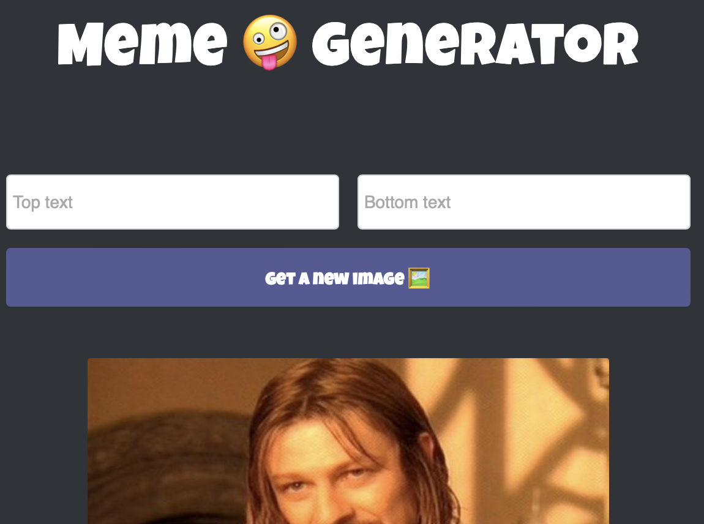

# Memes Generator 🤪

Welcome to the Memes Generator! This web application allows you to create hilarious memes by adding custom text to popular meme images. Whether you want to share funny memes with friends or create your own viral content, this generator has got you covered.

## Features

- **Customizable Text:** Add your own top and bottom text to create personalized captions for your memes.
- **Random Meme Images:** Generate new meme images with a click of a button, thanks to the built-in random image selection.
- **Responsive Design:** Enjoy a seamless experience on various devices, including desktops, tablets, and mobile phones.

## Technologies Used

- **CSS
- **Javascript
- **React.js

The Memes Generator is built using the following methods:

- **React:** A JavaScript library for building user interfaces. React allows for efficient component-based development, enabling a smooth and interactive user experience.
- **React Hooks:** Leveraging the power of `useState`, this project uses React Hooks to manage state within functional components. The state allows for dynamic updates and ensures a responsive interface.
- **Event Listeners:** By utilizing event listeners, the Memes Generator captures user input and triggers actions, such as updating the meme text and fetching random meme images.
- **Conditional Rendering:** The application employs conditional rendering techniques to display different components based on the state, enabling a dynamic and intuitive user interface.
- **Side Effects (useEffect):** The `useEffect` hook is used to handle side effects, such as fetching meme data from an external API. It ensures that the necessary actions are performed when specific conditions are met.

## Getting Started

To run the Memes Generator locally and start creating your own memes, follow these steps:

1. Clone this repository: `git clone https://github.com/your-username/memes-generator.git`
2. Navigate to the project directory: `cd memes-generator`
3. Install the dependencies: `npm install`
4. Start the development server: `npm start`
5. Open your browser and visit: `http://localhost:3000`

Feel free to explore the code, modify it for your own use. If you encounter any issues or have suggestions for improvements, please submit an issue.

## License

This project is licensed under the [MIT License](LICENSE).

## Acknowledgements

The Memes Generator project was developed as part of code along project for [Scrimba's React Bootcamp](https://scrimba.com/). 

---

Have fun generating memes and sharing laughter with the Memes Generator! If you find this project useful, consider giving it a star and sharing it with others. Happy meme-making!
